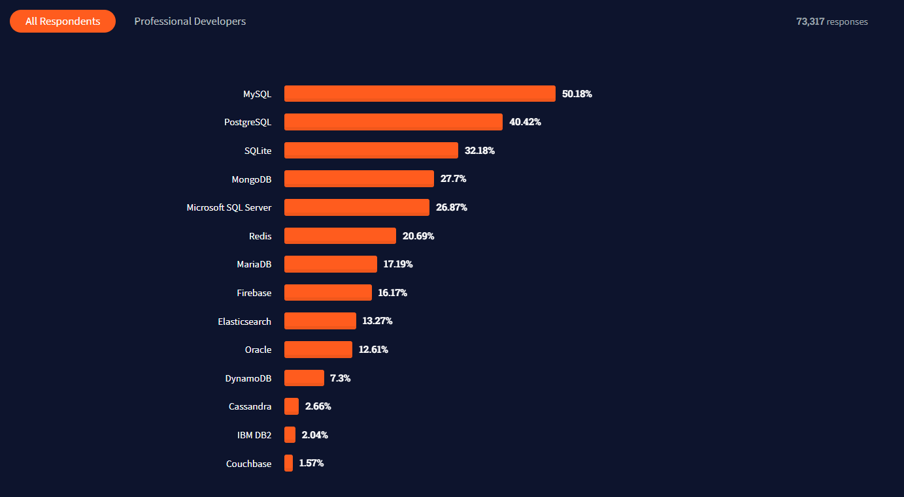
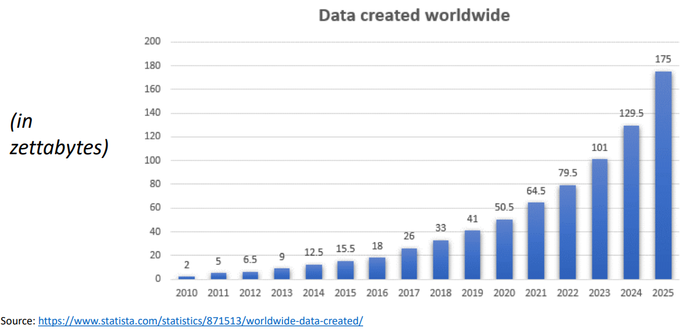
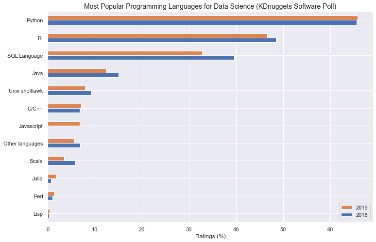
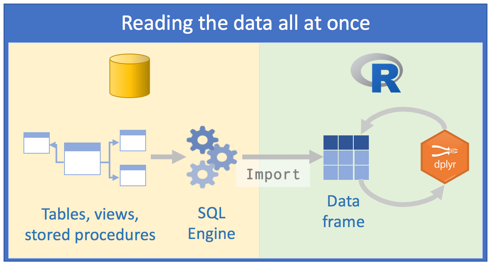
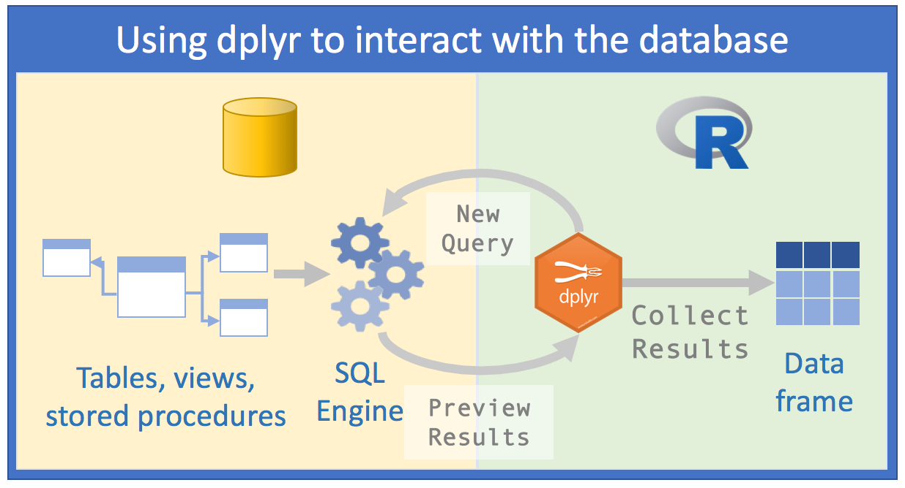

# Database in R

## What is a database?
{height=100%}

## What is a database?
- A database can be defined as a collection of related data items within a specific business process or problem setting.

- A database management system (DBMS) is the software package used to define, create, use, and maintain a database

- SQL, OR Structured Query Language, is an incredible tool for querying and managing relational databases.

## DBMS Ranking
{width=100%}

## Data created
{width=100%}

## Why do we need a Database?
- Databases support good data access because
- Large volumes of data can be stored in one place
- Multiple users can read and modify the data at the same time
- Databases are searchable and sortable, so the data you need can be found quick and easily

## Who is a database users?

A database user is a person who will run applications to perform specific database operations. He/she can also directly query the database using interactive querying facilities for reporting purposes.

## Roles in Data Management
- The information architect (or information analyst) designs the conceptual data model
- The database designer translate the conceptual data model into a logical data model
- The data owner has the authority to ultimately decide on the acess to, and usage of, the data.
- The database administrator (DBA) is responsible for the implementation and monitoring of the database
- The data analyst, business analyst, and data scientist responsible for analyzing the data to provide new insight about customer behaviour using analytical techniques and methods 

## Popular Languages for Data Science

## Difficulties of Working with Large Datasets
As described by Edgar Ruiz, when connecting to a database in R there is only a “small conduit” between R and the database that often prevents us from being able to work with the data as fast as we can work with local data frames. In order to work around this there have historically been two different options:

- The first option is to take data from the database in small chunks, save it in R memory, and then analyze it later
- A different option is to load all of the data into R

## Who has done this in the past?
{width=100%}

## Major problem with those methods

The main problem with these methods is that they are trying to perform the computations locally in R as opposed to performing computations directly on the data in the database using the SQL Engine. Ideally, we want to be able to analyze the data in place.

As R programmers, we of course want to write solely R code. Won't we?

## Using dplyr to query the database

{width=100%}

## Using dplyr to Query the Database
The `dplyr` package allows for better communications with external databases. Enabling us to do the following:

- Push the computation to the database, allowing us to avoid bringing large amounts of data in the database into the R environment unless we specifically ask R to do it.
- We can use pipe code, which greatly enhances the readability of the code
- All the code is in R

## Let's code
{width=100%}