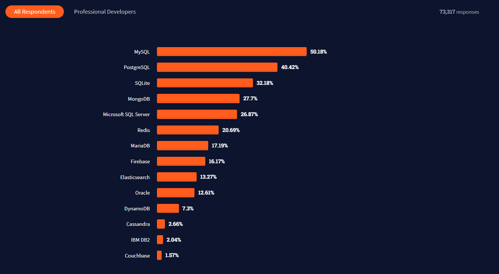
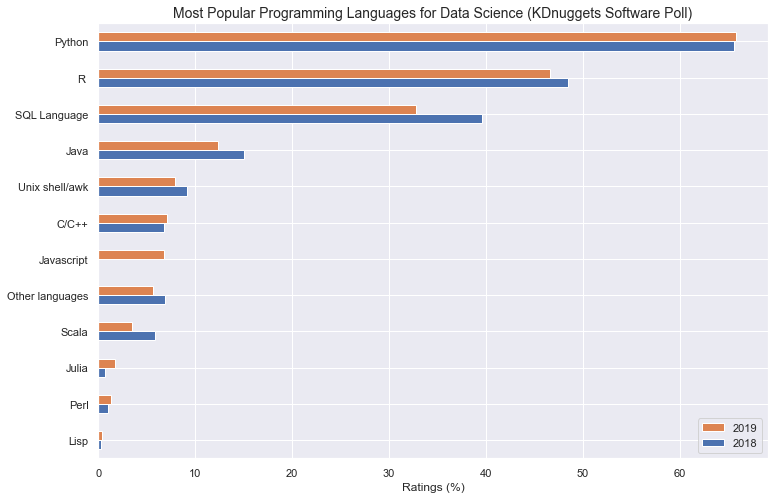

```{r setup, include=FALSE}
knitr::opts_chunk$set(echo = FALSE)
```
## Who is Dennis Irorere? 
{width=50%}

## What is a database?
{height=100%}

## What is a database?
- A database can be defined as a collection of related data items within a specific business process or problem setting.

- A database management system (DBMS) is the software package used to define, create, use, and maintain a database

- SQL, OR Structured Query Language, is an incredible tool for querying and managing relational databases.

- A relational database is a collection of information that organizes data in predefined relationships where data is stored in one or more tables of columns and rows.

## DBMS Ranking
{width=100%}

## Data created
{width=100%}


## Why do we need a Database?
- Databases support good data access because
- Large volumes of data can be stored in one place
- Multiple users can read and modify the data at the same time
- Databases are searchable and sortable, so the data you need can be found quick and easily

## Who is a database users?

A database user is a person who will run applications to perform specific database operations. He/she can also directly query the database using interactive querying facilities for reporting purposes.

## Roles in Data Management
- The information architect (or information analyst) designs the conceptual data model
- The database designer translate the conceptual data model into a logical data model
- The data owner has the authority to ultimately decide on the acess to, and usage of, the data.
- The database administrator (DBA) is responsible for the implementation and monitoring of the database
- The data analyst, business analyst, and data scientist responsible for analyzing the data to provide new insight about customer behaviour using analytical techniques and methods 

## Popular Languages for Data Science


## Difficulties of Working with Large Datasets
As described by Edgar Ruiz, when connecting to a database in R there is only a “small conduit” between R and the database that often prevents us from being able to work with the data as fast as we can work with local data frames. In order to work around this there have historically been two different options:

- The first option is to take data from the database in small chunks, save it in R memory, and then analyze it later
- A different option is to load all of the data into R

## Who has done this in the past?
{width=100%}

## Major problem with those methods

The main problem with these methods is that they are trying to perform the computations locally in R as opposed to performing computations directly on the data in the database using the SQL Engine. Ideally, we want to be able to analyze the data in place.

As R programmers, we of course want to write solely R code. Won't we?


## Using dplyr to query the database

{width=100%}

## Using dplyr to Query the Database
The `dplyr` package allows for better communications with external databases. Enabling us to do the following:

- Push the computation to the database, allowing us to avoid bringing large amounts of data in the database into the R environment unless we specifically ask R to do it.
- We can use pipe code, which greatly enhances the readability of the code
- All the code is in R

## Let's code
{width=100%}

## Install and load Packages
- `dplyr` - focuses on retrieving and analyzing datasets for generating SELECT SQL Statement
- `dbplyr` - enables `dplyr` to interact with databases. It also contains the vendor-specific SQL translation
- `DBI` - Allows R send commands to database irrespective of the database management systems used
- `RSQLite` - This package allows R to interface with SQLite databases
```
install.packages(c("dplyr", "dbplyr", "DBI", "RSQLite", "dbplot", "ggplot2"))
```
```{r, echo=TRUE, warning=FALSE, message=FALSE}
library(DBI)
library(dplyr)
library(dbplyr)
```

## Download Chinook databse and Connect to the database

```
setwd("C:/Users/Dee/root/Projects/basic_projects/Hands_on-DataScience/databases-R")
url <-  'https://www.sqlitetutorial.net/wp-content/uploads/2018/03/chinook.zip'
download.file(url, "chinook.zip")
unzip("chinook.zip")
```

We will use the `dbConnect()` function from the `DBI` package to connect to the database. The value for the Driver argument is the name we determined in the Database Driver section above.
```{r, echo = TRUE}
chinook <- dbConnect(RSQLite::SQLite(), "chinook.db")
```

This command creates a reference to the database, and tells R to connect to this database in a specific location.

## Inspect the chinook database

```{r, echo = TRUE}
src_dbi(chinook)
```
The above function display the location of the database, as well as the tables contained in the database. This database consist of tables such as `albums`, `artists`, `customers`, `employees`, `genres`, `invoice_items`, `invoices`, `media_types`, `tracks`, `playlists`, `playlist_track`

Now that we know we can connect to the database, let's explore how to query the data from a specific table into R

## Querying the database with SQL Syntax
To connect to tables within a database, you can use the `tbl()` function from `dplyr`. This function can be used to send SQL queries to the database.

```{r, echo = TRUE}
tbl(chinook, sql("SELECT * FROM employees LIMIT 100"))
```
With this approach you can use SQL queries if you are comfortable with SQL

## Querying the database with dply Syntax
One of the strengths of `dplyr` is that the same operation can be done using `dplyr`’s verbs instead of writing SQL. First, we select the table on which to do the operations by creating the `employee` object, and then we use the standard `dplyr` syntax as if it were a data frame.

```{r, echo = TRUE}
employees <- tbl(chinook, "employees")
employees %>% 
  select(EmployeeId, LastName, FirstName, Title, ReportsTo, Phone, Email)
```
In this case, the `employees` object behaves like a data frame. Several functions that can be used with the data frames can also be used on tables from a database. 

## Lets use familiar `dplyr` commands to query the database

```
head(employees, n = 10)
```

```{r, echo = TRUE}
employees %>% 
  select(LastName, FirstName, Title, ReportsTo, Phone) %>% 
  arrange(LastName)
```

## `dplyr` filter and arrange function

```{r, echo = TRUE}
employees %>% 
  filter(Title == "Sales Support Agent") %>% 
  select(LastName, FirstName, Address) %>% 
  arrange(LastName)
```

## `dplyr` group_by and summarize functions
```{r, echo = TRUE}
employees %>% 
  group_by(ReportsTo) %>% 
  summarize(numberAtLocation = n())
```

## SQL translation
Relational databases typically use a special-purpose language, Structured Query Language (SQL), to manage and query data.

```
SELECT 
  *
FROM
  employees
LIMIT
  10
```
Behind the scenes, dplyr:

- translates your R code into SQL
- submits it to the database
- translates the database’s response into an R data frame

## Lets look under the hood of the dplyr's code
```{r, echo=TRUE}
show_query(head(employees, n = 10))
```
The output shows the actual SQL query sent to the database; it matches our manually constructed SELECT statement above.

Instead of having to formulate the SQL query ourselves - and having to mentally switch back and forth between R and SQL syntax - we can delegate this translation to dplyr. (You don’t even need to know SQL to interact with a database via dplyr!)


## Laziness
Hadley Wickham, the author of dplyr explains:

When working with databases, dplyr tries to be as lazy as possible:

- It never pulls data into R unless you explicitly ask for it.
- It delays doing any work until the last possible moment - it collects together everything you want to do and then sends it to the database in one step

When you construct a `dplyr` query, you can connect multiple verbs into a single pipeline. For example, we combined the filter() and select() verbs using the %>% pipe.


## More example of `dplyr` in action 
```{r, echo=TRUE}
salesSupportAgents <- employees %>% 
  filter(Title == "Sales Support Agent") %>% 
  select(LastName, FirstName, Address) %>% 
  arrange(LastName) %>% 
  collect()
salesSupportAgents
```

As we’ve seen, for simple tasks, and even many complex tasks, dplyr syntax can be used to query external databases.

## Using dbplot for visualization
We can use the same chinook database from SQLite we were using above. Suppose we desire to see how many types of each employee there are in the database. We can produce a barplot to show this.

```{r,out.width="70%"}
library(dbplot)
employees %>% 
  dbplot_bar(Title)
```

## Customized dbplot
```{r, echo=TRUE, out.width="70%"}

library(ggplot2)
employees %>% 
  dbplot_bar(Title) + 
  labs(title = "Employee Types") + 
  ylab("Count") + 
  theme_classic()
```


## References
- https://www.jeffdoser.com/files/for875/_book/databases-and-r.html
- https://rviews.rstudio.com/2017/05/17/databases-using-r/
- https://datacarpentry.org/R-ecology-lesson/05-r-and-databases.html

